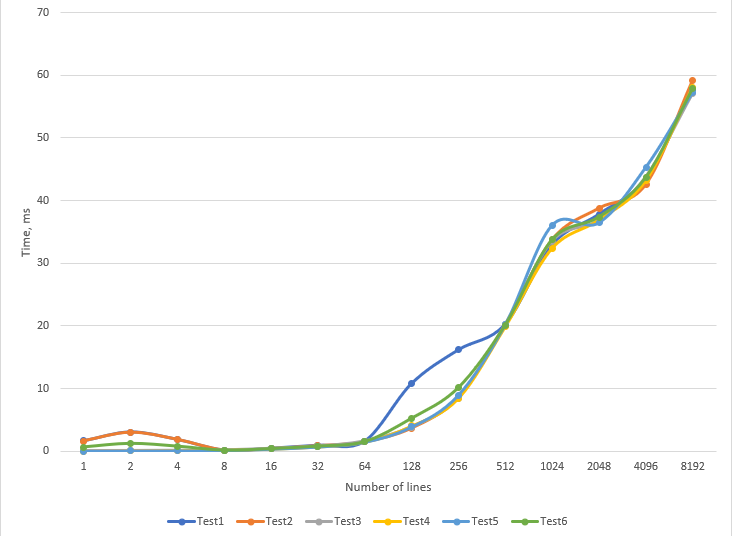
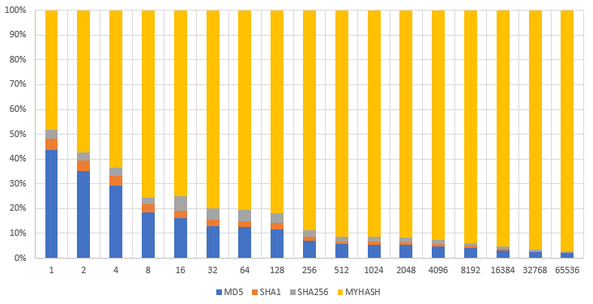
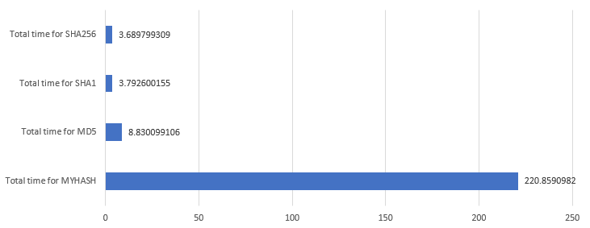

# Hash Function Concept in Pseudo-Code

This `generateHash` function takes two inputs: a string `input` and a `salt`. The hashing process involves several key steps, including character-to-code conversion, multiplication with prime numbers, reducing values, and generating a final hashed string. Below is the main idea of how the function works, described step-by-step in pseudo-code.

### Pseudo-Code:

    Function generateHash(input, salt):

    1. Initialize empty array inputArr.

    2. Concatenate input with salt to create a new string newInput.
    
    3. Loop through each character in newInput:
        a. Convert each character to its ASCII value.
        b. Store these values in inputArr.
    
    4. Define a fixed array outputArr consisting of prime numbers:
        - [2, 3, 5, 7, 11, ..., up to around 300]
    
    5. Define helper function smallify():
        a. Loop through each element in outputArr:
            i.  If the element is greater than 10,000, divide it by 100.
    
    6. Define core hashing logic function doHash():
        a. Set curentIndex to 0.
        b. Loop through each element of inputArr:
            i.  Multiply elements in outputArr with values from inputArr.
            ii. If curentIndex reaches the end of outputArr, reset curentIndex to 0.
            iii. Call smallify() after each multiplication round.
    
    7. Execute doHash() for the first pass.
    
    8. Sort inputArr in descending order.
    
    9. Reverse the order of outputArr.
    
    10. Execute doHash() for the second pass.
    
    11. Define function createFinalHash():
        a. Initialize empty string finalHash.
        b. Loop through outputArr:
            i.  Convert each value to a character using modulo arithmetic.
            ii. Append the character to finalHash.
    
    12. Return finalHash as the resulting hash.

### Key Steps:
- **Character-to-Code Conversion**: The input and salt are converted into an array of ASCII codes (`inputArr`).
- **Prime Multiplication**: These ASCII codes are then multiplied with an array of predefined prime numbers (`outputArr`), ensuring the values stay manageable by calling `smallify()` to reduce them when needed.
- **Multiple Hash Passes**: The hash function runs twice—once with the original `inputArr` and then again after sorting `inputArr` and reversing `outputArr`.
- **Final Hash Generation**: The resulting numbers in `outputArr` are converted into a mix of alphanumeric characters to produce the final hash string.

# Eksperimentinis tyrimas ir rezultatų analizė

## 1. Testinių įvedimo failų kūrimas

Sukurkite šiuos testinius failus:

- **Failai, sudaryti tik iš vieno simbolio:**
  - `simbolisA.txt`: failas, kuriame yra tik vienas simbolis, pvz., "A".
  - `simbolisB.txt`: failas, kuriame yra tik vienas simbolis, pvz., "B".

- **Failai, sudaryti iš daugiau nei 1000 atsitiktinai sugeneruotų simbolių:**
  - `atsitiktinai1000A.txt`: failas su daugiau nei 1000 atsitiktinai sugeneruotų simbolių.
  - `atsitiktinai1000B.txt`: kitas failas su daugiau nei 1000 atsitiktinai sugeneruotų simbolių.

- **Failai, sudaryti iš daugiau nei 1000 simbolių, bet skiriasi tik vienu simboliu:**
  - `vienodi1000A.txt`: failas su daugiau nei 1000 simbolių.
  - `vienodi1000B.txt`: failas, kuris nuo `vienodi1000A.txt` skiriasi tik vienu simboliu, pvz., simboliu vidurinėje pozicijoje.

- **Tuščias failas:**
  - `empty.txt`: failas, kuriame nėra jokių simbolių.

## 2. Testavimas naudojant sukurtus failus

Naudojant sukurtus failus kaip programos įvedimo duomenis, buvo atliekami šie tyrimai, siekiant patikrinti hash funkcijos deterministiškumą ir rezultatų dydį.

- **Failai su vienu simboliu:**
  - Hash for file `simbolisA.txt` is:  
    `dd16ca5283d31b7515973164e84e86ca402ec86c3502835bceafbd34da66c452`
  - Hash for file `simbolisB.txt` is:  
    `337d21b8fb5b92ec8bfd97ca4e93db0e8451fb95a98765442100fedc8a93e1c6`

- **Failai su daugiau nei 1000 atsitiktinai sugeneruotų simbolių:**
  - Hash for file `atsitiktinai1000A.txt` is:  
    `382b12c6dd2ae1db8b10b0aa5e5eccf70e95355600a88a8327bf641517b97278`
  - Hash for file `atsitiktinai1000B.txt` is:  
    `17219836056eed0950a5db99abe2063803df29b3ce474327f84efd0243dbbf72`

- **Failai su daugiau nei 1000 simbolių, bet skiriasi vienu simboliu:**
  - Hash for file `vienodi1000A.txt` is:  
    `2c01c2bb4756beec245868fb532bee9a65e776acf4da8237dec274c3da94a06a`
  - Hash for file `vienodi1000B.txt` is:  
    `964badf2e6b0fce14ca956c838597761575234ed3203e4289ab6e84d36676dab`

- **Tuščias failas:**
  - Hash for file `empty.txt` is:  
    `231a20835680bd3f58c7d80cdf5794c79fe4f61846ce901de060379e1afff359`

## 3. Ištirkite Jūsų sukurtos hash funkcijos efektyvumą, t.y., patikrinkite, kaip Jūsų hash'avimo funkcija atitinka 4-ą reikalavimą. Tuo tikslu pirmiausiai suhash'uokite vieną eilutę iš failo konstitucija.txt ir išmatuokite kiek laiko visa tai užtruko

The table below shows the execution times (in milliseconds) for different numbers of lines. The same tests were run multiple times, and we calculate the average time for each group.

| Number of Lines | Run 1 (ms) | Run 2 (ms) | Run 3 (ms) | Run 4 (ms) | Run 5 (ms) | Average (ms) |
|-----------------|------------|------------|------------|------------|------------|--------------|
| 1               | 1.651      | 1.641      | 0.051      | 0.042      | 0.041      | 0.6852       |
| 2               | 3.079      | 3.010      | 0.060      | 0.060      | 0.057      | 1.2532       |
| 4               | 1.893      | 1.873      | 0.093      | 0.094      | 0.092      | 0.8090       |
| 8               | 0.190      | 0.168      | 0.159      | 0.197      | 0.155      | 0.1738       |
| 16              | 0.482      | 0.405      | 0.407      | 0.406      | 0.402      | 0.4204       |
| 32              | 0.957      | 0.856      | 0.763      | 0.748      | 0.740      | 0.8128       |
| 64              | 1.602      | 1.487      | 1.594      | 1.491      | 1.490      | 1.5328       |
| 128             | 10.780     | 3.657      | 3.848      | 4.045      | 3.894      | 5.2448       |
| 256             | 16.176     | 8.610      | 8.437      | 8.452      | 8.969      | 10.1288      |
| 512             | 20.259     | 20.071     | 20.196     | 19.859     | 20.187     | 20.1144      |
| 1024            | 32.949     | 33.753     | 33.489     | 32.377     | 36.052     | 33.7240      |
| 2048            | 37.827     | 38.794     | 36.834     | 36.916     | 36.456     | 37.3654      |
| 4096            | 43.544     | 42.573     | 43.736     | 43.161     | 45.266     | 43.6560      |
| 8192            | 57.727     | 59.191     | 57.051     | 58.019     | 57.221     | 57.8418      |

### Averages Summary
- **Average for 1 line**: 0.6852ms
- **Average for 2 lines**: 1.2532ms
- **Average for 4 lines**: 0.8090ms
- **Average for 8 lines**: 0.1738ms
- **Average for 16 lines**: 0.4204ms
- **Average for 32 lines**: 0.8128ms
- **Average for 64 lines**: 1.5328ms
- **Average for 128 lines**: 5.2448ms
- **Average for 256 lines**: 10.1288ms
- **Average for 512 lines**: 20.1144ms
- **Average for 1024 lines**: 33.7240ms
- **Average for 2048 lines**: 37.3654ms
- **Average for 4096 lines**: 43.6560ms
- **Average for 8192 lines**: 57.8418ms

### Time Complexity: O(n log n)

## 4-5. Susigeneruokite bent 100 000 atsitiktinių simbolių eilučių ( string 'ų) porų, patikrinkite, ar visais atvejais gautieji porų hash'ai nesutampa.

- Program returned: **SUCCESS: no match found!**

## 6. Susigeneruokite bent 100 000 atsitiktinių simbolių eilučių ( string 'ų) porų, Įvertinkite Jūsų gautų hash'ų procentinį "skirtingumą": bitų lygmenyje; hex'ų lygmenyje;

### Procentinis skirtingumas pagal Levenshtein:

### Hex'ų lygmenyje:
- **Minimali skirtumo reikšmė**: 0.00%
- **Maksimali skirtumo reikšmė**: 9.84%
- **Vidutinė skirtumo reikšmė**: 4.39%

### Bitų lygmenyje:
- **Minimali skirtumo reikšmė**: 16.67%
- **Maksimali skirtumo reikšmė**: 86.41%
- **Vidutinė skirtumo reikšmė**: 63.48%

## 7. Kur yra Jūsų hash funkcijos stiprybės ir kokie buvo nustatyti trūkumai?

### Stiprybės
1. **Lavinos efektas**: Hash funkcija tinkamai atitinka lavinos efekto reikalavimą. Maži įvedimo duomenų pakeitimai (vieno simbolio pakeitimas) sukelia žymius pokyčius hash rezultatuose, tiek **bitų** lygmenyje, tiek **hex** lygmenyje. Tai užtikrina, kad hash'ų panašumas net ir panašiuose įvedimuose bus minimalus.
   
2. **Deterministiškumas**: Funkcija yra deterministinė, todėl tas pats įvesties duomenų rinkinys visada grąžins tą patį hash'ą, kas yra būtina savybė tinkamai hash funkcijai.

3. **Efektyvumas**: Hash funkcija sugeba apdoroti didelį kiekį duomenų (iki 1000 simbolių eilučių). Tai daro funkciją tinkamą didelių duomenų rinkinių apdorojimui, o tai itin svarbu realaus pasaulio taikymams, pavyzdžiui, duomenų bazėms ar kriptografijai.

### Trūkumai
1. **Laiko sudėtingumas**: Nustatyta, kad hash funkcijos veikimo laiko sudėtingumas gali būti problema su didesnėmis įvesties eilutėmis. Kai įvesties eilutės ilgis viršija tam tikrą ribą (pvz., 1000 simbolių), hash skaičiavimo laikas ženkliai išauga. Tai gali lemti našumo problemas apdorojant itin didelius duomenis.

# 1. Hash Function Performance Comparison [Papildomai: iki 0.25 balo]

This document aims to objectively compare the performance of our custom hash function (`MYHASH`) with established hash functions: MD5, SHA-1, and SHA-256. The comparison will be based on the time taken to hash varying amounts of data, measured in milliseconds.

## Methodology

1. **Hashing Process**: Each hash function was executed **five times** for each data size, and the **average time** taken to compute the hash was recorded.
2. **Measurement**: The time was measured in milliseconds for each function at different data sizes.
3. **Performance Metrics**: The total time taken for each hashing function was calculated to summarize their performance.

## Data

Below are the recorded average times (in ms) for each hash function:

| Data Size (string lenght) |       MD5       |      SHA-1      |     SHA-256     |      MYHASH     |
|--------------------|----------------|-----------------|-----------------|-----------------|
| 1                  | 0.373899937    | 0.039400101     | 0.032999992     | 0.412100077     |
| 2                  | 0.397799969    | 0.048300266     | 0.039000034     | 0.649200201     |
| 4                  | 0.411700010    | 0.056300163     | 0.047600031     | 0.893000364     |
| 8                  | 0.428299904    | 0.071100235     | 0.064100027     | 1.735200167     |
| 16                 | 0.444199800    | 0.080000162     | 0.158200026     | 2.036400318     |
| 32                 | 0.459099770    | 0.085300207     | 0.162900209     | 2.824400187     |
| 64                 | 0.474299908    | 0.091200113     | 0.167400122     | 3.033100128     |
| 128                | 0.489399910    | 0.097300053     | 0.171900034     | 3.403400183     |
| 256                | 0.501799822    | 0.103000164     | 0.176999807     | 6.198900223     |
| 512                | 0.524199724    | 0.111600161     | 0.185400009     | 8.561800241     |
| 1024               | 0.552199841    | 0.119300127     | 0.190599918     | 9.045100212     |
| 2048               | 0.579699755    | 0.125600100     | 0.195400000     | 10.06990027     |
| 4096               | 0.623199701    | 0.134700060     | 0.201800108     | 12.14400029     |
| 8192               | 0.697599888    | 0.147000074     | 0.212100029     | 15.91860032     |
| 16384              | 0.797399759    | 0.161200047     | 0.224799871     | 24.01510024     |
| 32768              | 1.012699842    | 0.187200069     | 0.248099804     | 39.13340020     |
| 65536              | 1.444599867    | 0.230499983     | 0.288100004     | 70.83600020     |

### Total Times

- **Total time for MYHASH**: 220.8590982 ms
- **Total time for MD5**: 8.830099106 ms
- **Total time for SHA-1**: 3.792600155 ms
- **Total time for SHA-256**: 3.689799309 ms

## Analysis

1. **Speed Comparison**:
   - **MD5**, **SHA-1**, and **SHA-256** are significantly faster than `MYHASH` across all data sizes.
   - As the input size increases, `MYHASH` exhibits a substantial increase in hashing time compared to the standard hash functions.

2. **Performance Trends**:
   - For small data sizes, the performance gap is smaller, but as the input size increases, the time for `MYHASH` grows rapidly, suggesting that it may not be optimized for larger data sizes.

3. **Conclusion**:
   - Based on the collected data, while `MYHASH` might serve specific use cases, it does not match the performance of MD5, SHA-1, or SHA-256 in terms of speed.
